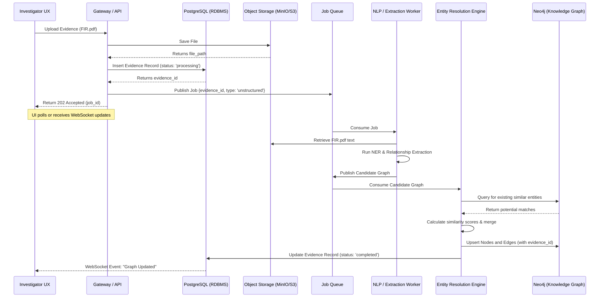

# 4. End-to-End System Architecture & Data Ingestion

This section details the overarching system pipeline and the specific mechanisms by which raw data enters the VEILLE ecosystem.

## 4.1 End-to-End Data-to-Decision Pipeline

The system follows a layered, service-oriented architecture. Each layer is designed to be independently replaceable (Modular Design Principle A2), and analytical outputs generated at the end of the pipeline must preserve mathematical provenance back to the source evidence ingested at the beginning (Evidence-Aware Principle A3).

### Architectural Objectives

| Objective | Meaning | Implementation Strategy |
| :--- | :--- | :--- |
| **A1 — Multisource** | Support heterogeneous investigation data. | Separate ingestion parsers for CSV (CDRs/Transactions) and PDF/Docx (FIRs). |
| **A2 — Modular** | Major subsystems are independently replaceable. | Loose coupling via Redis queues between Ingestion, NLP, and Graph storage. |
| **A3 — Evidence-Aware** | Results preserve provenance to source docs. | Every Neo4j relationship edge contains an array of `source_evidence_ids`. |
| **A4 — Explainable** | AI outputs must have supporting evidence. | No black-box classifications; predictions include a confidence score and reasoning trace. |

### Component Overview
1. **API Gateway (FastAPI / Node.js):** Handles authentication, routing, and rate limiting.
2. **Ingestion Service:** Validates file uploads and dumps them into Object Storage, immediately returning an `evidence_id`.
3. **Queue Manager (Redis):** Orchestrates the asynchronous pipeline so the UI never blocks during heavy NLP processing.
4. **NLP / Extraction Workers (Python):** Consume jobs from the queue, run NER (Named Entity Recognition), and emit JSON candidate graphs.
5. **Entity Resolution Engine:** Deduplicates the candidate graph against the existing Neo4j knowledge graph.
6. **Knowledge Graph (Neo4j):** Stores the final resolved nodes and relationships.
7. **System of Record (PostgreSQL):** Stores relational metadata (users, audit logs, case statuses).

---

## 4.2 Data Ingestion Workflows

Data ingestion is the most critical chokepoint. If garbage data enters the system, the graph analytics will be meaningless. VEILLE uses strongly-typed ingestion pathways depending on the source material.

### 4.2.1 Structured Data Ingestion (CDRs & Financials)
Structured data provides high-fidelity, explicit relationships but lacks context.

- **Process:** User uploads a CSV of Call Detail Records.
- **Validation:** The system maps the CSV columns to the expected schema (Caller, Receiver, Timestamp, Duration, Cell Tower ID).
- **Extraction:** This bypasses the heavy NLP worker. It goes directly to the Entity Resolution engine.
- **Edge Creation:** Creates `COMMUNICATES_WITH` edges with high confidence (`confidence: 0.95`).

### 4.2.2 Unstructured Data Ingestion (FIRs, Reports)
Unstructured data provides rich context but requires probabilistic extraction.

- **Process:** User uploads a scanned PDF FIR.
- **OCR Phase:** If the PDF is an image, it is routed through Tesseract/Cloud Vision to extract raw text.
- **NLP Phase:** The text is passed to a fine-tuned transformer model (e.g., a customized spaCy pipeline or a fine-tuned BERT model for Indian context).
- **Candidate Generation:** The model identifies entities (e.g., "Rajesh Kumar", "DL-4C-1234") and their syntactical relationships.
- **Edge Creation:** Creates candidate edges with variable confidence (`confidence: 0.60 - 0.85`) depending on the NLP model's certainty.

### 4.2.3 Sequence Diagram: The Ingestion Lifecycle

The following diagram illustrates the exact technical flow from the moment an investigator clicks "Upload Evidence" to the moment the graph is updated.

### 4.2.4 Handling Ingestion Failures
To prevent the system from entering a broken state, the ingestion pipeline implements a Dead Letter Queue (DLQ).
- If the OCR fails, or the NLP worker crashes on an malformed document, the job is moved to the DLQ in Redis.
- The PostgreSQL `evidence` record is marked `status: 'failed'`.
- The UI alerts the investigator, allowing them to manually review the document or re-try the upload. No corrupted data reaches Neo4j.
