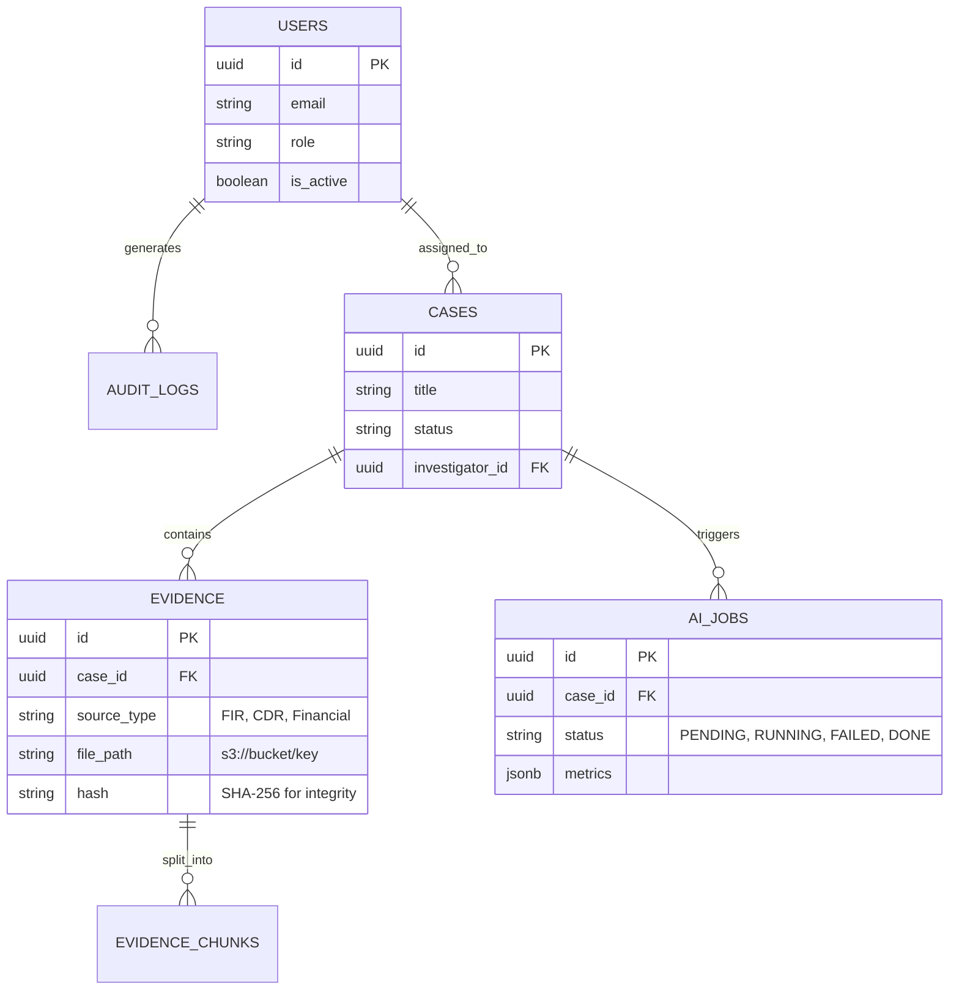

# 7. Data Architecture, Knowledge Graph Schema & Database Design

This section defines exactly what VEILLE stores, how entities connect, and how the application retrieves them. It represents the deepest engineering layer of the system.

## 7.1 Storage Architecture: The Polyglot Approach
VEILLE deliberately splits storage by workload rather than forcing all data into a single, suboptimal paradigm:

| Store | Technology | Role | Holds |
| :--- | :--- | :--- | :--- |
| **Relational DB** | PostgreSQL | System of Record | Users, Cases, Evidence Metadata, Audit Logs, AI Jobs |
| **Graph DB** | Neo4j | Knowledge Graph | Nodes (Entities) and Edges (Relationships) |
| **Object Store** | MinIO / AWS S3 | Raw Evidence | Immutable source PDFs, images, and extraction artifacts |
| **Cache/Queue** | Redis | Async Layer | Task queues (Celery/BullMQ), transient state, caching |

## 7.2 PostgreSQL Entity-Relationship (ER) Model
PostgreSQL handles all transactional and access-control data.



## 7.3 Neo4j Ontology
The ontology defines the domain model. We enforce strict node labels to ensure graph queries remain performant.
Core Nodes: `Person`, `Organization`, `Phone`, `Vehicle`, `Account`, `Location`, `Event`.

## 7.4 Complete Node Schema
Every node in Neo4j includes standard metadata alongside domain-specific properties.

**Standard Metadata (All Nodes):**
- `id` (UUID)
- `case_id` (UUID - for case isolation)
- `created_at` (Timestamp)
- `updated_at` (Timestamp)

**Specific Node Properties:**
- **Person:** `name`, `aliases` (Array), `gender`, `dob`, `risk_score` (computed)
- **Phone:** `number` (E.164 format), `carrier`, `imei`
- **Account:** `account_number`, `bank_name`, `ifsc_code`
- **Vehicle:** `registration_number`, `make`, `model`, `color`
- **Location:** `address`, `latitude`, `longitude`, `geohash`

## 7.5 Complete Relationship Schema
Edges define how nodes interact. Every edge is directional.

- `(Person)-[:AFFILIATED_WITH]->(Organization)`
- `(Person)-[:USES]->(Phone)`
- `(Person)-[:OWNS]->(Account)`
- `(Person)-[:COMMUNICATES_WITH {duration, timestamp}]->(Person)`
- `(Account)-[:TRANSFERRED_TO {amount, currency, timestamp}]->(Account)`
- `(Person)-[:PARTICIPATED_IN]->(Event)`
- `(Event)-[:OCCURRED_AT]->(Location)`
- `(Person)-[:LINKED_TO]->(Vehicle)`

## 7.6 Evidence Provenance Model
This is VEILLE's defining feature. **Every single edge** in Neo4j must carry provenance metadata.

```cypher
// Example Edge Properties in Neo4j
{
  "confidence": 0.85, 
  "source_evidence_ids": ["evd-101", "evd-205"], // Points back to PostgreSQL
  "extraction_method": "NLP_Model_v3",
  "verified_by_human": true,
  "verification_timestamp": "2026-08-30T10:00:00Z"
}
```

## 7.7 Case Isolation Model
In law enforcement, Case A must not leak data to Case B unless explicitly requested.
- **Neo4j Implementation:** Every node and relationship is tagged with a `case_id` property. Every Cypher query implicitly includes a `WHERE n.case_id = $current_case` clause.
- **Cross-Case Analysis:** Only authorized users can execute queries omitting the `case_id` filter to find global bridges (e.g., "Does this phone number in Case A appear in any other open cases?").

## 7.8 Data Lineage
Data lineage guarantees that a finding in a report can always be walked back to the original document.
1. Analyst clicks edge in Graph UI.
2. UI reads `source_evidence_ids` from edge properties.
3. UI queries PostgreSQL for `EVIDENCE` matching those IDs.
4. PostgreSQL returns the S3 path.
5. UI fetches and displays the original PDF FIR, highlighting the extracted text.

## 7.9 Object-Storage Architecture
- **Bucket Structure:** `s3://VEILLE-data/cases/{case_id}/raw/` and `s3://VEILLE-data/cases/{case_id}/processed/`.
- **Immutability:** The `raw` bucket has Object Lock enabled. Once a file is uploaded (and its SHA-256 hash stored in PostgreSQL), it cannot be modified or deleted, preserving legal chain of custody.

## 7.10 Redis & Job Architecture
Long-running tasks (like running an LLM over a 50-page PDF) cannot happen in the synchronous HTTP request/response cycle.
- **Celery/BullMQ Integration:** The API Gateway pushes a job ID to Redis.
- Workers consume the queue.
- WebSocket connections notify the UI when the job ID marks as `COMPLETED`.

## 7.11 Indexing Strategy
To ensure sub-second graph traversals on millions of nodes:
- **Neo4j Composite Index:** `CREATE INDEX ON :Person(name, aliases)` for fast entity resolution candidate matching.
- **Neo4j Property Index:** `CREATE INDEX ON ()-[r:COMMUNICATES_WITH]-() (r.confidence)` to quickly filter out low-confidence AI guesses during visualization.
- **PostgreSQL B-Tree:** `CREATE INDEX ON evidence(case_id)` and `CREATE INDEX ON audit_logs(actor_id)`.

## 7.12 Graph Query Patterns
Common Cypher queries optimized for the application:
```cypher
// Query: Find the shortest path between two suspects within a specific case, considering only high-confidence edges.
MATCH p=shortestPath((a:Person {id: $startId})-[:COMMUNICATES_WITH|TRANSFERRED_TO*1..4]-(b:Person {id: $endId}))
WHERE a.case_id = $caseId AND b.case_id = $caseId
AND ALL(r IN relationships(p) WHERE r.confidence > 0.70)
RETURN p
```

## 7.13 API / Database Mapping
- `/api/cases` -> Hits PostgreSQL
- `/api/evidence/upload` -> Hits S3, then PostgreSQL, then Redis
- `/api/graph/nodes` -> Hits Neo4j
- `/api/graph/path` -> Hits Neo4j

## 7.14 Data Lifecycle
- **Active:** Data is readily available in PG/Neo4j.
- **Archived:** When a case is closed, the graph data for that case can be exported as a GraphML file, stored in S3, and purged from Neo4j to save RAM. The PostgreSQL metadata remains.

## 7.15 Backup & Recovery
- **PostgreSQL:** Nightly WAL archiving and pg_dump.
- **Neo4j:** Nightly enterprise backups.
- **Demo Hardening:** We maintain a "Known Good State" snapshot of both DBs. Before a judge presentation, a single script drops the current state and restores the snapshot, ensuring the flagship demo always works.

## 7.16 Scalability Architecture
- **Stateless API:** The FastAPI layer scales horizontally.
- **Worker Nodes:** NLP workers can be scaled horizontally based on Redis queue depth.
- **Database Scaling:** PostgreSQL and Neo4j are scaled vertically for the MVP. In a production scenario, Neo4j Causal Clustering would be deployed.
