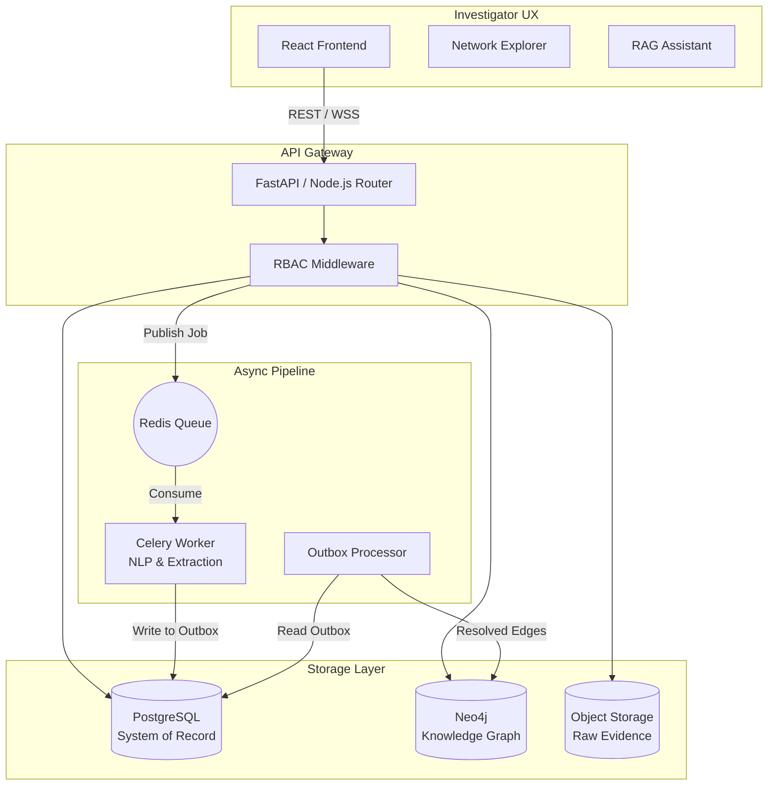
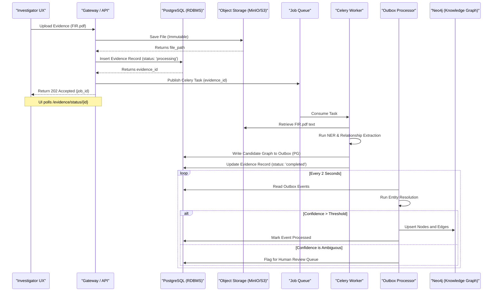

# Layer 2: How We Build VEILLE

## 1. End-to-End System Architecture Pipeline

The system follows a layered, service-oriented architecture designed to decouple slow AI extraction tasks from the fast interactive graph UI. Each subsystem represents a distinct phase in the intelligence lifecycle.

### The Hybrid AI Philosophy
VEILLE does **not** route all tasks through a Large Language Model. We utilize a hybrid approach where each technology performs the job it is best suited for:
- **Deterministic Code:** API routing, Data Pipelines, and Role-Based Access Control (RBAC).
- **Natural Language Processing (NLP):** Entity extraction from unstructured text.
- **Statistical Machine Learning:** Entity resolution and confidence scoring.
- **Graph Algorithms:** Network analysis (centrality, community detection).
- **Large Language Models (LLM):** Investigator interaction (RAG) and human-readable explanation of evidence.

### 1.1 System Architecture Diagram

## 2. Data Ingestion Architecture

Data ingestion is the system's most critical chokepoint. VEILLE uses strongly-typed ingestion pathways depending on the source material to prevent "garbage-in, garbage-out" scenarios.

### 2.1 Structured Data Ingestion (CDRs, Financials)
Structured data provides high-fidelity, explicit relationships but lacks context.
- **Process:** User uploads a CSV of Call Detail Records (CDRs).
- **Validation:** The system maps the CSV columns to the expected schema (Caller, Receiver, Timestamp, Duration, Cell Tower ID).
- **Extraction:** This bypasses the heavy NLP worker. It goes directly to the Entity Resolution engine.
- **Result:** Creates `COMMUNICATES_WITH` edges with high Extraction Confidence.

### 2.2 Unstructured Data Ingestion (FIRs, Reports)
Unstructured data provides rich context but requires probabilistic extraction.
- **Process:** User uploads a scanned PDF FIR.
- **OCR Phase:** If the PDF is an image, it is routed through an OCR engine (e.g., Tesseract or Cloud Vision).
- **NLP Phase:** Text is passed to a specialized NLP model (e.g., a custom spaCy pipeline or fine-tuned Transformer).
- **Candidate Generation:** The model identifies entities (e.g., "Rajesh Kumar") and syntactic relationships.
- **Result:** Emits "candidate edges" with varying Extraction Confidence based on the model's certainty.

### 2.3 The Ingestion Sequence Diagram

The following diagram details the exact asynchronous technical flow from the moment an investigator clicks "Upload" to the moment the graph updates.

### 2.4 Failure Paths and the Dead Letter Queue (DLQ)
To prevent the system from entering a broken state, the asynchronous pipeline implements a Dead Letter Queue (DLQ) in Redis.
- If the OCR fails, or the NLP worker crashes on a malformed document, the job is moved to the DLQ.
- The PostgreSQL `evidence` record is marked `status: 'failed'`.
- The UI alerts the investigator, allowing them to manually review the document. No corrupted or partial data reaches Neo4j.
