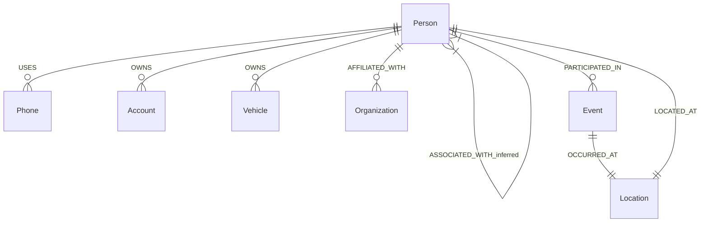
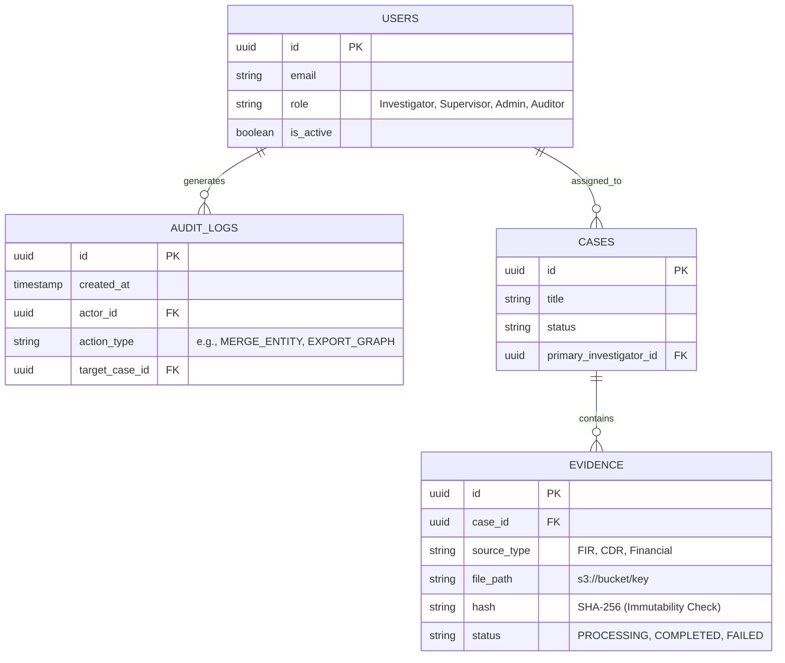

# Layer 2: Knowledge Graph & Data Architecture

This section defines the core data model, the ontology, and the mathematical framework we use to assess the reliability of the intelligence we generate. 

## 1. The Canonical Graph Ontology

VEILLE standardizes all heterogeneous law enforcement data into a strict canonical ontology. Adhering to a rigid schema ensures that Cypher queries remain performant and predictable.

### 1.1 The Node Taxonomy
- `Person`: Investigation subjects, witnesses, associates, known offenders.
- `Phone`: E.164 formatted phone numbers, IMEIs.
- `Account`: Bank or financial accounts.
- `Vehicle`: License plates, chassis numbers.
- `Organization`: Companies, NGOs, known gangs, shell corporations.
- `Location`: Geocoded coordinates, addresses, regions.
- `Event`: A dated occurrence (e.g., "Meeting", "Incident", "Transaction").

### 1.2 The Relationship Taxonomy (Edges)
Relationships in VEILLE are strictly categorized as either **Observed** (extracted directly from an evidence source) or **Inferred/Predicted** (calculated by the analytics engine).

| Source Node | Edge Label | Target Node | Nature | Description |
| :--- | :--- | :--- | :--- | :--- |
| `Person` | `USES` | `Phone` | Observed | Derived from CDRs or FIR statements. |
| `Person` | `OWNS` | `Account` | Observed | Derived from financial records. |
| `Person` | `OWNS` | `Vehicle` | Observed | Derived from registration or surveillance. |
| `Person` | `AFFILIATED_WITH` | `Organization` | Observed | Derived from intelligence reports or OSINT. |
| `Person` | `COMMUNICATES_WITH` | `Person` | Observed | Derived from overlapping CDRs. |
| `Person` | `PARTICIPATED_IN` | `Event` | Observed | Derived from FIRs or incident reports. |
| `Event` | `OCCURRED_AT` | `Location` | Observed | Geographic anchoring of events. |
| `Person` | `LOCATED_AT` | `Location` | Observed | Known addresses or cell-tower pings. |
| `Person` | `ASSOCIATED_WITH` | `Person` | Inferred | AI prediction based on triadic closure or shared assets. |

### 1.3 Neo4j Ontology Diagram



## 2. The 5-Layer Confidence Model

Because VEILLE deals in probabilities rather than absolute truths, we formally distinguish between different types of "confidence." Conflating these leads to analytical errors.

| Layer | Type | Question Answered | Example Mechanism |
| :--- | :--- | :--- | :--- |
| **L1** | **Extraction Confidence** | *How confident is the NLP model that this string of text represents a Person entity?* | Softmax output of the NER Transformer model. |
| **L2** | **Resolution Confidence** | *How confident are we that "Rajesh K." and "Rajesh Kumar" are the exact same physical person?* | Jaro-Winkler string distance + shared graph neighbors. |
| **L3** | **Relationship Confidence** | *How strongly does the underlying evidence support this specific connection?* | A connection appearing in 5 separate FIRs has higher confidence than one appearing in 1 FIR. |
| **L4** | **Analytical Significance** | *How structurally important is this entity within the current graph?* | Betweenness Centrality score (Brokerage potential). |
| **L5** | **Investigation Priority** | *How useful is this finding for the investigator right now?* | A composite heuristic. High Priority = High Centrality + High Resolution Confidence. |

> [!WARNING] 
> **Ethical Boundary Enforcement:** VEILLE never outputs a "Risk Score", "Guilt Score", or "Criminality Score". The highest-level metric is strictly `investigation_priority` (L5). A shared lawyer might have an exceptionally high `investigation_priority` due to network bridging, while possessing zero criminal guilt.

## 3. Database & Storage Architecture

### 3.1 Polyglot Persistence
- **PostgreSQL:** System of Record (Users, Cases, Evidence Metadata, Audit Logs).
- **Neo4j:** Knowledge Graph (Nodes, Edges, Provenance).
- **S3 / MinIO:** Immutable Object Storage for raw PDFs, CSVs, and images.

### 3.2 PostgreSQL Entity-Relationship (ER) Model



### 3.3 Evidence Provenance in the Graph
To maintain auditability, every observed edge in Neo4j contains metadata linking it back to the PostgreSQL `EVIDENCE` table.

```json
// Example Neo4j Edge Properties
{
  "edge_type": "COMMUNICATES_WITH",
  "relationship_confidence": 0.85, 
  "source_evidence_ids": ["evd-101", "evd-205"],
  "extraction_method": "NLP_Model_v3",
  "verified_by_human": true
}
```

### 3.4 Performance & Scalability
The indexing strategy (Composite Indexes on Names, Property Indexes on Confidence) is designed to support low-latency graph traversal at prototype and production scale, subject to hardware deployment and query characteristics. Advanced features like Neo4j Causal Clustering will be evaluated post-MVP.
