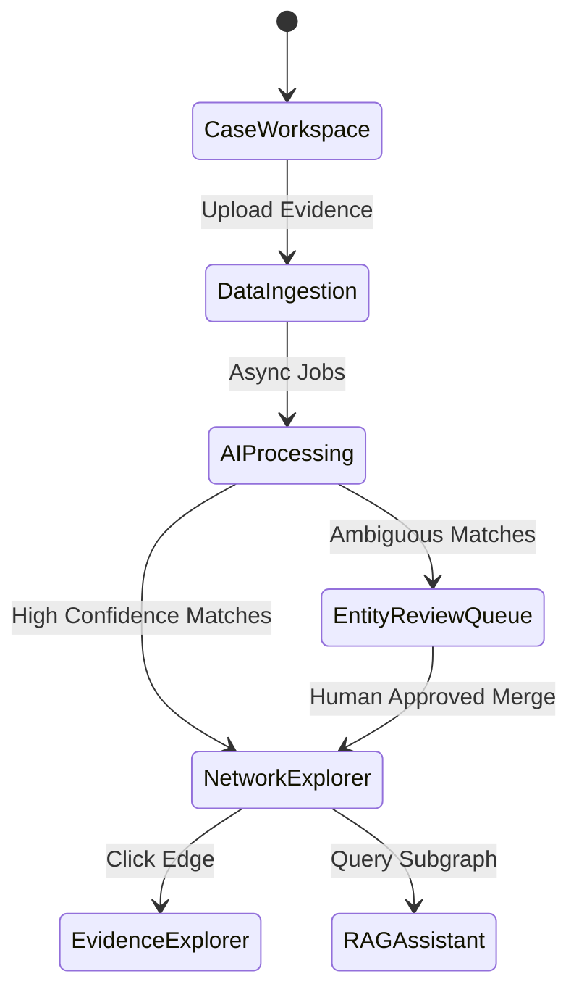

# Layer 2: API Architecture & Investigator UX

VEILLE’s user interface is designed specifically for law enforcement professionals. It prioritizes clarity, auditability, and speed, actively avoiding overwhelming the user with raw data by structuring interactions into distinct, logical workflows.

## 1. Investigator UX Workflows



### 1.1 The Case Workspace
All data is strongly isolated. When an investigator logs in, they select an active case. This defines the boundary for all subsequent searches and graph visualizations, ensuring that data from unrelated investigations does not pollute the current analytical context.

### 1.2 The Entity Review Queue (Human-in-the-Loop)
Because AI predictions are not infallible, VEILLE includes a mandatory human-in-the-loop step.
- When the Entity Resolution engine identifies a potential match with a Confidence Score between 0.60 and 0.89, it places it in the Review Queue.
- The investigator clicks **[Merge]** or **[Keep Separate]**, immediately updating the graph.

### 1.3 The Network Explorer
The flagship view of VEILLE.
- **Visuals:** Nodes represent entities, edges represent relationships.
- **Interactions:**
  - **Click Node:** Opens a side-panel with entity details.
  - **Click Edge:** Shows the extraction confidence and a hyperlink to the exact sentence in the FIR/CDR that generated it (Evidence Provenance).
  - **Expand/Collapse:** Investigators can double-click a node to fetch its immediate neighbors (1-hop traversal), preventing the "hairball" problem of loading 10,000 nodes at once.
- **Blast Radius:** Highlights all entities within N hops of a selected suspect.

## 2. Final API Contracts

To ensure seamless integration between the React frontend and the FastAPI backend, we define strict API contracts. Notice the strict adherence to the Canonical Ontology and the removal of subjective "risk" terminology in favor of analytical priority.

### 2.1 Fetch Node Details (REST)
```json
// GET /api/v1/cases/101/nodes/person-452
{
  "id": "person-452",
  "labels": ["Person"],
  "properties": {
    "name": "Rajesh Kumar",
    "aliases": ["Raju"],
    "investigation_priority": 0.85
  },
  "provenance": [
    {
      "evidence_id": "evd-992",
      "source_type": "FIR",
      "extracted_by": "NER_Model_v2",
      "extraction_confidence": 0.95
    }
  ],
  "metadata": {
    "note": "investigation_priority is an analytical prioritization score, not a probability of criminality or guilt."
  }
}
```

### 2.2 Fetch Shortest Path (REST)
```json
// GET /api/v1/cases/101/analysis/shortest-path?source=person-452&target=person-881
{
  "path_found": true,
  "hops": 2,
  "path": [
    {"type": "node", "id": "person-452", "name": "Rajesh Kumar"},
    {"type": "edge", "relation": "USES", "relationship_confidence": 0.99},
    {"type": "node", "id": "phone-112", "number": "+91-9876543210"},
    {"type": "edge", "relation": "COMMUNICATES_WITH", "relationship_confidence": 1.0},
    {"type": "node", "id": "person-881", "name": "Amit Singh"}
  ]
}
```

### 2.3 Resolve Entities (REST - Review Queue Action)
```json
// POST /api/v1/cases/101/resolution/merge
{
  "source_node_id": "person-101",
  "target_node_id": "person-452",
  "action": "MERGE",
  "actor_id": "inv-007",
  "timestamp": "2026-08-30T12:00:00Z"
}
```
