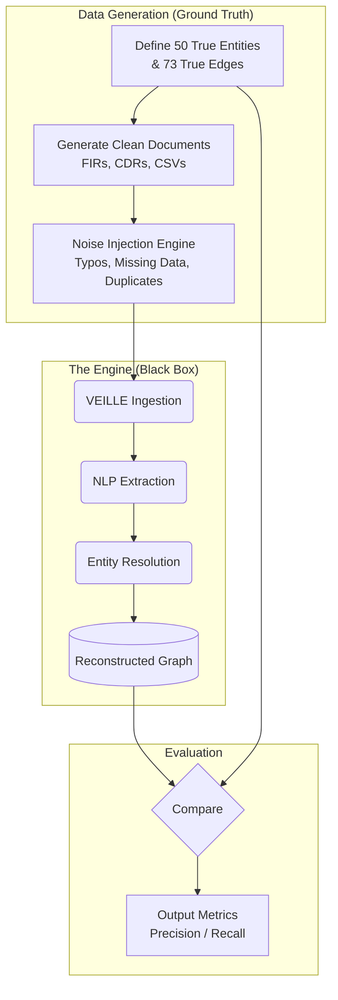

# Layer 3: Prove It — Synthetic Data & Evaluation

The SIH judging criteria heavily weigh whether a solution actually works or is merely a UI mock-up. Competitors will likely hardcode a perfect graph into Neo4j. We will not. 

Instead, the **Synthetic Dataset Generator** is elevated to a first-class engineering component. It provides a measurable AI story, proving our Entity Resolution and Relationship Extraction pipelines function correctly on noisy, real-world data.

## 1. The Evaluation Pipeline

Our proof relies on measuring the delta between a "Perfect Answer Key" and the graph that VEILLE reconstructs from noisy, unstructured documents.

## 2. Ground-Truth & Noise Injection Design

1. **The Answer Key:** We hand-author a 'true' network of 50 entities (e.g., a smuggling ring with two distinct clusters bridged by a single corrupt logistics manager).
2. **Document Generation:** A Python script generates realistic source documents that describe this true network using variable phrasing.
3. **Noise Injection (Crucial Step):** The script deliberately injects real-world messiness controlled by probability parameters:
   - *Typographical Noise ($p=0.15$):* "Rajesh Kumar" mutates into "Raju Kumar" or "R. Kumar".
   - *Missing Data ($p=0.10$):* A CDR entry missing a cell tower ID.
   - *Duplicate Entities ($p=0.05$):* Two different physical people sharing the exact same name but having different phone numbers.
   - *Red Herrings ($p=0.20$):* Adding random, unconnected individuals to the FIR text to test if the analytics engine correctly ignores them.

## 3. Measurable AI Evaluation Metrics

Because we possess the "Answer Key", we can mathematically evaluate the system before the presentation. This allows us to say to the judges: 
> *"Our synthetic ground truth contains X entities and Y known relationships. After heavy noise injection, VEILLE autonomously recovered Z entities and W relationships, achieving XX.X% Precision and XX.X% Recall in entity resolution."*
> 
> **(Note: The numbers above are placeholders. Final metrics will be generated after running VEILLE against the controlled ground-truth dataset.)**

### 3.1 Entity Resolution Metrics
- **True Positive (TP):** The ER engine successfully merged "Rajesh K." and "Rajesh Kumar" into a single node because they shared a phone number.
- **False Positive (FP):** The ER engine accidentally merged two different people named "Amit Singh".
- **False Negative (FN):** The ER engine failed to merge two variations of the same person, leaving duplicate nodes in the graph.

### 3.2 Relationship Extraction Metrics
- **True Positive:** The NLP engine found the `COMMUNICATES_WITH` link hidden in paragraph 3 of an unstructured FIR.
- **Precision:** $TP / (TP + FP)$ — *When VEILLE says a relationship exists, how often is it right?*
- **Recall:** $TP / (TP + FN)$ — *Out of all the real relationships hidden in the documents, what percentage did VEILLE find?*

This level of rigorous evaluation transforms VEILLE from a "hackathon project" into a defensible, production-ready architecture.
