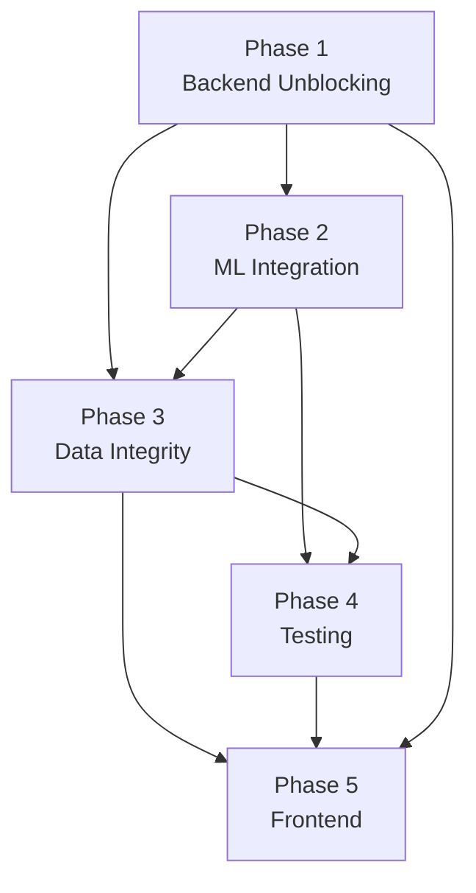

# 16 MASTER PHASE-BY-PHASE IMPLEMENTATION ROADMAP

**Status:** MASTER REFERENCE — Active
**Last Updated:** 2026-09-01
**Scope:** VEILLE v4.0 — Prototype → Production MVP

This is the canonical, atomic task-level roadmap. Every task has a clear owner, effort estimate, dependency chain, and a verifiable definition of done. Use this document alongside the phase-specific IMPL_* specs.

---

## Overview

```
┌─────────────────────────────────────────────────────────────────────────┐
│                    VEILLE v4.0 PRODUCTION ROADMAP                     │
│                                                                         │
│  Phase 1      Phase 2      Phase 3      Phase 4      Phase 5            │
│  Week 1       Week 2       Week 3       Week 4       Week 5             │
│  ────────     ────────     ────────     ────────     ────────           │
│  Backend      ML Engine    Data         Testing &    Frontend           │
│  Unblocking   Integration  Integrity    Observ.      Polish             │
│                                                                         │
│  JWT Auth     Real NLP     Outbox       Unit Tests   Error Bounds       │
│  Real Queries Entity Res.  Pattern      Integration  Real API           │
│  Kafka Fix    Celery DLQ   Analytics    E2E Tests    WebSockets         │
│                                         CI Pipeline  TypeScript         │
└─────────────────────────────────────────────────────────────────────────┘
```

**Total Effort:** ~29.5 developer-days  
**Team:** 1 Backend Lead + 1 ML Engineer + 1 QA + 1 Frontend Engineer  
**Calendar:** 5 weeks (25 working days, accounting for review/integration time)

---

## Phase 1 — Backend Unblocking

> **Spec Reference:** [IMPL_11_SECURITY_SPEC.md](./IMPL_11_SECURITY_SPEC.md) · [IMPL_13_DEPLOYMENT_SPEC.md](./IMPL_13_DEPLOYMENT_SPEC.md)
> **Priority:** CRITICAL — Nothing downstream can be built or tested without this.
> **Week:** 1

### Task Breakdown

| # | Task | Owner | Effort | Depends On | Spec |
|---|---|---|---|---|---|
| 1.1 | Create `.env.template` at project root | DevOps | 0.5d | — | IMPL_13 §1 |
| 1.2 | Add `.env` to `.gitignore` | DevOps | 0.1d | 1.1 | IMPL_13 §1 |
| 1.3 | Fix Kafka Docker listener config (dual listener setup) | DevOps | 0.5d | 1.1 | IMPL_13 §2 |
| 1.4 | Move all hardcoded constants to `backend/core/config.py` using `pydantic-settings` | Backend | 0.5d | 1.1 | IMPL_13 §1 |
| 1.5 | Implement `bcrypt` password hashing for `USERS` table | Backend | 0.5d | DB running | IMPL_11 §4 |
| 1.6 | Implement `POST /api/v1/auth/login` with real JWT generation | Backend | 1d | 1.5 | IMPL_11 §2 |
| 1.7 | Store refresh token in `httpOnly` cookie (`POST /api/v1/auth/refresh`) | Backend | 0.5d | 1.6 | IMPL_11 §2.3 |
| 1.8 | Fix `require_role()` decorator to validate JWT signature + expiry | Backend | 0.5d | 1.6 | IMPL_11 §3 |
| 1.9 | Add case isolation: `GET /api/cases` filters by `primary_investigator_id` | Backend | 0.5d | 1.8 | IMPL_11 §3.3 |
| 1.10 | Replace mocked `GET /api/graph/{case_id}` with real Neo4j Cypher query | Backend | 1d | Neo4j running | IMPL_02 |
| 1.11 | Replace mocked `GET /api/cases` with real PostgreSQL query | Backend | 0.5d | DB running | IMPL_01 |
| 1.12 | Replace mocked `GET /api/evidence/{case_id}` with real PostgreSQL query | Backend | 0.5d | DB running | IMPL_01 |
| 1.13 | Add Alembic migration runner to startup (`alembic upgrade head`) | Backend | 0.5d | 1.4 | IMPL_13 §5 |
| 1.14 | Create admin seed script (create first ADMIN user from `.env` on first run) | Backend | 0.5d | 1.5 | IMPL_11 §4 |

**Phase 1 Total: ~7.1 days**

### Phase 1 Exit Criteria (all must pass before Phase 2 begins)

```
✅ POST /api/v1/auth/login returns a signed JWT for valid credentials
✅ POST /api/v1/auth/login returns 401 for invalid credentials
✅ GET /api/graph/{case_id} returns real nodes/edges from Neo4j (not hardcoded)
✅ Page refresh does NOT log the investigator out
✅ INVESTIGATOR cannot access another investigator's cases (returns 403)
✅ docker ps shows all 7 containers healthy including Kafka
✅ kafka-topics --list succeeds (CDR consumer starts cleanly)
```

---

## Phase 2 — ML & Intelligence Engine Integration

> **Spec Reference:** [IMPL_04_NLP_SPEC.md](./IMPL_04_NLP_SPEC.md) · [IMPL_05_ENTITY_RESOLUTION_SPEC.md](./IMPL_05_ENTITY_RESOLUTION_SPEC.md) · [IMPL_15_ERROR_HANDLING_SPEC.md](./IMPL_15_ERROR_HANDLING_SPEC.md)
> **Priority:** CRITICAL — Core differentiator of the platform.
> **Week:** 2

### Task Breakdown

| # | Task | Owner | Effort | Depends On | Spec |
|---|---|---|---|---|---|
| 2.1 | Remove all hardcoded test data from `ml/nlp/extractor.py` | ML | 0.5d | GEMINI_API_KEY in `.env` | IMPL_04 |
| 2.2 | Implement real Gemini API call with the constrained system prompt | ML | 1d | 2.1 | IMPL_04 §2 |
| 2.3 | Implement Pydantic validation + 3-retry loop on LLM output failure | ML | 1d | 2.2 | IMPL_04 §3 |
| 2.4 | Test extraction on 5 real sample FIR documents (manual QA review) | ML | 1d | 2.3 | IMPL_04 §4 |
| 2.5 | Implement `VEILLEBaseTask` in `workers/base_task.py` | Backend | 0.5d | Phase 1 | IMPL_15 §4.1 |
| 2.6 | Refactor `extract_entities_task` to inherit `VEILLEBaseTask` + full try/except | Backend | 0.5d | 2.5 | IMPL_15 §4.2 |
| 2.7 | Implement DLQ routing in `VEILLEBaseTask.on_failure()` | Backend | 0.5d | 2.5 | IMPL_15 §4.1 |
| 2.8 | Update `Evidence.status` to `FAILED` on task permanent failure | Backend | 0.5d | 2.7 | IMPL_15 §4.2 |
| 2.9 | Add `GET /api/jobs/{job_id}` status polling endpoint | Backend | 0.5d | Phase 1 | IMPL_03 |
| 2.10 | Implement real string-distance entity matching (Levenshtein / RapidFuzz) | ML | 1d | 2.4 | IMPL_05 |
| 2.11 | Implement graph-proximity entity matching (query Neo4j for candidate matches) | ML | 1d | 2.10 | IMPL_05 |
| 2.12 | Implement confidence scoring: auto-merge (>0.85), review queue (0.5–0.85), reject (<0.5) | ML | 1d | 2.11 | IMPL_05 |
| 2.13 | Add `POST /api/review-queue/merge` and `reject` endpoints wired to real logic | Backend | 0.5d | 2.12 | IMPL_03 |
| 2.14 | Add global FastAPI exception handlers (JSON error format, no stack traces to client) | Backend | 0.5d | Phase 1 | IMPL_15 §3 |
| 2.15 | Implement JSON structured logging across all backend modules | Backend | 0.5d | Phase 1 | IMPL_15 §3.2 |

**Phase 2 Total: ~9.5 days**

### Phase 2 Exit Criteria

```
✅ Upload FIR_001_Rajesh.txt → at least 3 entities appear in Neo4j within 60 seconds
✅ Upload a malformed/empty document → evidence.status = 'FAILED', DLQ has 1 entry
✅ Entity resolution merges "Rajesh K." and "Rajesh Kumar" (shared phone) correctly
✅ Ambiguous match (0.5–0.85 score) appears in Review Queue, not auto-merged
✅ API returns JSON error (not stack trace) on all 400/500 responses
✅ All Celery task events emit structured JSON logs
```

---

## Phase 3 — Data Integrity & Sync

> **Spec Reference:** [IMPL_14_DATA_SYNC_SPEC.md](./IMPL_14_DATA_SYNC_SPEC.md) · [IMPL_06_GRAPH_ANALYTICS_SPEC.md](./IMPL_06_GRAPH_ANALYTICS_SPEC.md)
> **Priority:** HIGH — Prevents silent data corruption and compliance violations.
> **Week:** 3

### Task Breakdown

| # | Task | Owner | Effort | Depends On | Spec |
|---|---|---|---|---|---|
| 3.1 | Write Alembic migration for `outbox_events` table | Backend | 0.5d | Phase 1 (Alembic running) | IMPL_14 §3 |
| 3.2 | Create `OutboxEvent` SQLAlchemy model | Backend | 0.5d | 3.1 | IMPL_14 §4 |
| 3.3 | Refactor all service methods to write outbox events in-transaction | Backend | 1d | 3.2 | IMPL_14 §5 |
| 3.4 | Implement `process_outbox_events` Celery Beat task | Backend | 1d | 3.3 | IMPL_14 §6 |
| 3.5 | Implement idempotency: use MERGE (not CREATE) in all Neo4j writes | Backend | 0.5d | 3.4 | IMPL_14 §7 |
| 3.6 | Implement outbox processor DLQ routing after 5 retries | Backend | 0.5d | 3.4 | IMPL_14 §6 |
| 3.7 | Implement cascade delete: delete Case → outbox event → Neo4j DETACH DELETE | Backend | 0.5d | 3.4 | IMPL_14 §8 |
| 3.8 | Implement real PageRank centrality Cypher query for `GET /api/analytics/{case_id}` | Backend | 1d | Phase 1 (real Neo4j queries) | IMPL_06 |
| 3.9 | Implement community detection (Louvain) via Neo4j GDS plugin | Backend | 1d | 3.8 | IMPL_06 |
| 3.10 | Add `GET /admin/dlq` endpoint for Supervisor/Admin review of failed jobs | Backend | 0.5d | Phase 2 DLQ | IMPL_15 §5.2 |
| 3.11 | Implement Celery Flower container in docker-compose | DevOps | 0.5d | — | IMPL_15 §6.3 |

**Phase 3 Total: ~6.5 days**

### Phase 3 Exit Criteria

```
✅ outbox_events table exists in Postgres (alembic upgrade head succeeds)
✅ Uploading evidence → outbox_events row created → Neo4j updated within 5 seconds
✅ Replaying the same outbox event twice → only 1 Neo4j node (idempotency works)
✅ Delete Case → all Neo4j nodes for that case are removed (no orphans)
✅ GET /api/analytics/{case_id} returns real PageRank scores (not hardcoded)
✅ Celery Flower UI accessible at localhost:5555
✅ GET /admin/dlq returns current DLQ contents
```

---

## Phase 4 — Testing & Observability

> **Spec Reference:** [IMPL_12_TESTING_SPEC.md](./IMPL_12_TESTING_SPEC.md) · [IMPL_13_DEPLOYMENT_SPEC.md](./IMPL_13_DEPLOYMENT_SPEC.md) §4
> **Priority:** HIGH — Required for production confidence and compliance.
> **Week:** 4

### Task Breakdown

| # | Task | Owner | Effort | Depends On | Spec |
|---|---|---|---|---|---|
| 4.1 | Create `docker-compose.test.yml` for isolated test environment | DevOps | 0.5d | Phase 1 | IMPL_13 §3 |
| 4.2 | Configure `pytest.ini` with test DB env vars | QA | 0.5d | 4.1 | IMPL_12 §3.2 |
| 4.3 | Write unit tests for `ml/nlp/extractor.py` (mock Gemini API) | QA | 1d | Phase 2 | IMPL_12 §4.1 |
| 4.4 | Write unit tests for `ml/entity_resolution/resolver.py` | QA | 1d | Phase 2 | IMPL_12 §4.2 |
| 4.5 | Write unit tests for `backend/auth/` (JWT gen, validation, RBAC) | QA | 1d | Phase 1 | IMPL_12 §4.3 |
| 4.6 | Write integration test: full FIR ingestion flow (upload → Neo4j) | QA | 1.5d | Phase 2 + 3 | IMPL_12 §5.1 |
| 4.7 | Write integration test: outbox sync (Postgres event → Neo4j node) | QA | 0.5d | Phase 3 | IMPL_12 §5.2 |
| 4.8 | Write integration test: unauthorized request → 401; wrong role → 403 | QA | 0.5d | Phase 1 | IMPL_12 §4.3 |
| 4.9 | Add OpenTelemetry instrumentation to FastAPI + SQLAlchemy + Redis | DevOps | 1.5d | Phase 1–3 stable | IMPL_13 §4 |
| 4.10 | Add OpenTelemetry instrumentation to Celery workers | DevOps | 0.5d | 4.9 | IMPL_13 §4.2 |
| 4.11 | Configure GitHub Actions CI pipeline with test + coverage gate | DevOps | 1d | 4.2–4.8 | IMPL_12 §8 |
| 4.12 | Run full test suite; fix failing tests until `--cov-fail-under=70` passes | QA | 1d | 4.3–4.8 | IMPL_12 §7 |

**Phase 4 Total: ~9.5 days**

### Phase 4 Exit Criteria

```
✅ pytest tests/unit/ passes with ≥80% coverage on ml/ modules
✅ pytest tests/integration/ passes against docker-compose.test.yml databases
✅ pytest --cov-fail-under=70 exits with code 0
✅ GitHub Actions CI runs on every PR and blocks merge on failure
✅ OpenTelemetry traces visible in Jaeger for: login → upload FIR → entity extraction
✅ docker-compose.test.yml spins up a clean isolated environment
```

---

## Phase 5 — Frontend Enhancement

> **Spec Reference:** [IMPL_09_FRONTEND_SPEC.md](./IMPL_09_FRONTEND_SPEC.md)
> **Priority:** MEDIUM — Polish and real-time usability.
> **Week:** 5

### Task Breakdown

| # | Task | Owner | Effort | Depends On | Spec |
|---|---|---|---|---|---|
| 5.1 | Create `src/components/ErrorBoundary.jsx` | Frontend | 0.5d | — | IMPL_09 §2 |
| 5.2 | Wrap all top-level route components in `ErrorBoundary` in `App.jsx` | Frontend | 0.5d | 5.1 | IMPL_09 §2 |
| 5.3 | Create centralized `src/api/client.js` with JWT header injection + 401 handling | Frontend | 1d | Phase 1 auth | IMPL_09 §3.1 |
| 5.4 | Add token refresh call on app init (`src/main.jsx`) to fix page-refresh logout | Frontend | 0.5d | 5.3, Phase 1.7 | IMPL_09 §3.2 |
| 5.5 | Replace hardcoded graph data in `NetworkExplorer` with real `GET /api/graph/{case_id}` | Frontend | 0.5d | 5.3, Phase 1.10 | IMPL_09 §8 |
| 5.6 | Replace hardcoded items in `ReviewQueue.jsx` with real API + POST merge/reject | Frontend | 0.5d | 5.3, Phase 2.13 | IMPL_09 §8 |
| 5.7 | Replace hardcoded logs in `AuditLogs.jsx` with real `GET /api/audit-logs` | Frontend | 0.5d | 5.3 | IMPL_09 §8 |
| 5.8 | Add loading skeleton components for graph, cases, evidence list | Frontend | 0.5d | — | IMPL_09 §4 |
| 5.9 | Add explicit error states (404, 500, offline) with retry button to all components | Frontend | 0.5d | 5.5–5.7 | IMPL_09 §6 |
| 5.10 | Implement `useGraphWebSocket` hook for live graph updates | Frontend | 1.5d | Phase 3 outbox done | IMPL_09 §5 |
| 5.11 | Wire WebSocket to `NetworkExplorer` for real-time graph node updates | Frontend | 0.5d | 5.10 | IMPL_09 §5 |
| 5.12 | Create `src/types/index.ts` with core TypeScript interfaces | Frontend | 0.5d | — | IMPL_09 §7 |
| 5.13 | Migrate `src/components/Login.jsx` → `Login.tsx` | Frontend | 0.5d | 5.12 | IMPL_09 §7 |
| 5.14 | Migrate `src/components/ErrorBoundary.jsx` → `ErrorBoundary.tsx` | Frontend | 0.2d | 5.12 | IMPL_09 §7 |
| 5.15 | Migrate `src/components/ReviewQueue.jsx` → `ReviewQueue.tsx` | Frontend | 0.5d | 5.12 | IMPL_09 §7 |

**Phase 5 Total: ~8 days**

### Phase 5 Exit Criteria

```
✅ Crashed component shows ErrorBoundary UI (not blank screen)
✅ Page refresh does NOT log user out (verified in browser DevTools → Network tab)
✅ Network Explorer shows real Neo4j data (verified: check XHR request in DevTools)
✅ Uploading a FIR updates the graph live without manual page refresh
✅ All 12 components show loading skeleton + error state (tested with API offline)
✅ npx tsc --noEmit passes with zero errors on src/components/ directory
```

---

## Code Quality Metrics Tracker

| Metric | Baseline (Now) | Phase 1 | Phase 2 | Phase 3 | Phase 4 | Phase 5 Target |
|---|---|---|---|---|---|---|
| Test Coverage | 5% | 5% | 10% | 15% | **70%** | 70% |
| API Endpoint Functionality | 10% | **80%** | 90% | 95% | 100% | 100% |
| ML Model Validation | 0% | 0% | **80%** | 85% | 90% | 90% |
| Authentication Coverage | 0% | **100%** | 100% | 100% | 100% | 100% |
| Distributed Tracing | 0% | 0% | 0% | 0% | **100%** | 100% |
| Error Handling Coverage | 20% | 30% | **80%** | 85% | 100% | 100% |
| DB Synchronization | 0% | 0% | 0% | **100%** | 100% | 100% |
| Frontend Real API Integration | 0% | 0% | 0% | 0% | 0% | **100%** |

---

## Cross-Phase Dependency Graph



> **Note:** Phase 3 and Phase 2 can run in parallel on Weeks 2–3 (different owners), but Phase 4 gates on both being stable.

---

## Definition of Done — Production MVP

The entire project is considered **Production MVP complete** when every item below is checked:

- [x] **P1:** Investigator can log in → session persists across page refresh
- [x] **P1:** `/api/graph/{case_id}` returns real Neo4j data
- [x] **P1:** Kafka CDR consumer starts cleanly
- [x] **P2:** FIR upload → entities in Neo4j within 60s
- [x] **P2:** Failed extraction → DLQ entry + evidence.status = FAILED
- [x] **P2:** Entity resolution deduplicates test cases at ≥80% precision
- [x] **P3:** Postgres ↔ Neo4j fully consistent (no orphaned nodes)
- [x] **P3:** Cascade delete removes all Case-associated graph nodes
- [x] **P4:** `pytest --cov-fail-under=70` passes
- [x] **P4:** CI pipeline blocks merge on test failure
- [x] **P4:** OpenTelemetry traces visible for full ingestion flow in Jaeger
- [x] **P5:** Graph updates in real-time after FIR upload (no page refresh)
- [x] **P5:** All 12 components show error state when API is offline
- [x] **P5:** `npx tsc --noEmit` passes on `src/components/`
