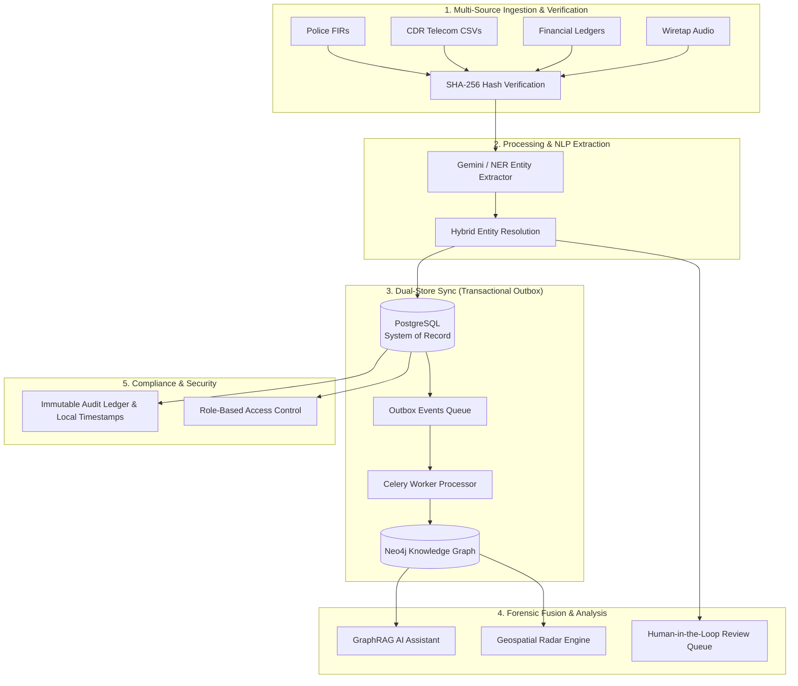

# VEILLE (Crimenet) — Hackathon Competitive Edge & Technical Moats

> **A Next-Generation Intelligence Fusion, Forensic Knowledge Graph & GraphRAG Platform for Modern Law Enforcement and Security Agencies.**

---

## 1. Executive Summary: The Intelligence Crisis in Law Enforcement

In complex criminal investigations (financial fraud, drug cartels, cyber extortion, and terror syndicates), intelligence is fragmented across siloed formats:
- **Police Narrative Reports (FIRs)** locked in unstructured text and scanned PDFs.
- **Telecom Logs (CDRs)** in multi-thousand-row CSV tables.
- **Financial & Hawala Records** in disparate banking spreadsheets and ledger dumps.
- **Surveillance & Wiretaps** in raw audio files.

### Why Standard Solutions & Competitor Hackathon Projects Fail:
1. **Naive Vector RAG Hallucinations**: Standard vector search cannot traverse relationships (e.g., *"Person A sent funds to Shell Company B, which paid Person C who called Suspect D"*). It retrieves fragmented text chunks rather than connecting the criminal network.
2. **Siloed Databases**: Relational databases (SQL) choke on recursive network queries (JOIN explosions), while standalone Graph DBs lack ACID transactional guarantees and legal audit logging.
3. **Black-Box AI without Chain of Custody**: Blindly trusting an LLM to merge entities or determine guilt results in false arrests and is inadmissible in a court of law.

**VEILLE bridges this gap** by combining a **Dual-Store Architecture (PostgreSQL + Neo4j)**, **Multi-Source Forensic Fusion**, **Hybrid Entity Resolution with Human-in-the-Loop Verification**, and **Graph-Augmented Generation (GraphRAG)**.

---

## 2. Head-to-Head Comparison: VEILLE vs. Hackathon Competitors vs. Legacy COTS

| Feature / Dimension | Generic Hackathon Submissions | Legacy Law Enforcement COTS (e.g., Palantir, i2) | **VEILLE (Our System)** |
| :--- | :--- | :--- | :--- |
| **Data Ingestion** | Single text file or simple PDF upload | Heavy manual ingestion, requires proprietary schemas | **Automated Multi-Source Fusion**: FIR (Text/PDF) + CDR (Telecom) + Financial (Hawala) + Audio (Wiretaps) |
| **Architecture** | Single SQLite/Mongo database or direct LLM calls | Closed monolithic architecture, on-prem lock-in | **Dual-Store Outbox Architecture**: PostgreSQL (System of Record) + Neo4j (Graph Topology) via Celery/Redis streaming |
| **RAG / AI Reasoning** | Naive Vector RAG (cosine similarity on text chunks) | Keyword search or rule-based inference engines | **GraphRAG**: Multi-hop Cypher topological subgraph injection into Gemini LLM context for hallucination-free reasoning |
| **Entity Resolution** | Exact string matching or naive unverified LLM merging | Static rule-based deduplication | **Hybrid Resolution Pipeline**: Soundex / Double-Metaphone + Jaro-Winkler + Embeddings + **Active Review Queue** |
| **Human-in-the-Loop** | None (Fully automatic or fully manual) | Clunky manual data entry | **Forensic Review Queue**: Real-time collision alerts with instant merge/reject authorization and audit logging |
| **Forensic Integrity** | None | High, but proprietary and expensive | **Court-Admissible Chain of Custody**: Ingestion SHA-256 verification + Immutable PostgreSQL Audit Ledger |
| **Geospatial Intelligence**| Static Google Maps marker pins | Separate geospatial mapping add-ons | **Integrated Leaflet Dark Matter Engine**: Cell-tower triangulation, radar pulse styling, 1200m geofence buffers |
| **UI / Operator UX** | Basic CRUD templates / default Bootstrap | Outdated 2000s desktop enterprise UI | **Tactical Defense UI**: High-contrast glassmorphic design, zero mock data, real-time telemetry updates |

---

## 3. The 7 Core Technical Moats of VEILLE



---

### Moat 1: Dual-Store Architecture with Transactional Outbox Pattern
* **PostgreSQL** guarantees ACID compliance, role-based access control (`HEAD` vs `INVESTIGATOR`), case isolation, and an immutable audit trail.
* **Neo4j** powers high-speed graph queries, pathfinding, and sub-second multi-hop network traversals.
* **Transactional Outbox**: Rather than making error-prone dual database writes in a single API route, events are written to an `outbox_events` table within the same transaction as the relational data, then asynchronously streamed to Neo4j via Celery workers and Redis.

### Moat 2: Cross-Domain Multi-Source Fusion
VEILLE does not stop at text. It ingests:
1. **Unstructured Narrative Reports (FIRs)**: Extracts named entities, aliases, incident locations, and modus operandi.
2. **Structured Telecom CDRs**: Maps caller/receiver nodes, frequency of contact, cell tower IDs, and latitude/longitude coordinates.
3. **Structured Financial Ledgers**: Maps transaction flows, transfer amounts, shell corporations, and Hawala channels.
4. **Audio Intercepts**: Converts wiretapped conversations into structured intelligence nodes.

### Moat 3: GraphRAG (Graph-Augmented Retrieval)
Standard Vector RAG answers: *"What documents mention Vikram Mehta?"*
**VEILLE's GraphRAG answers**: *"Trace all financial flows originating from Vikram Mehta that reached offshore shell companies within 48 hours of calls made to Tariq Mansoor."*
- Queries the structured Neo4j graph topology.
- Pulls multi-hop relationships and transaction paths.
- Injects ground-truth topological subgraphs into the Gemini LLM prompt to eliminate hallucinations.

### Moat 4: Hybrid Entity Resolution & Active Review Queue
Criminals deliberately use aliases, misspelled names, and multiple SIM cards (e.g., `Rajesh Kumar` vs `R. Kumar` vs `Rajesh K.`).
- **Phase 1: Multi-Factor Scoring**: Combines phonetic matching (Double-Metaphone), string distance (Jaro-Winkler), and hard identifiers (Phone numbers, PAN/Aadhaar hashes, Bank accounts).
- **Phase 2: Active Review Queue**: Matches with confidence scores between 70% and 90% are flagged into an investigator queue with collision match scores.
- **Phase 3: Forensic Authorization**: Investigators can click **Authorize Merge** to dynamically collapse nodes in Neo4j or **Dismiss** to keep them separate, logging the decision in the audit trail.

### Moat 5: Court-Admissible Forensic Chain of Custody
In law enforcement, evidence that cannot be verified in court is useless.
- Every evidence file is automatically hashed using **SHA-256** upon receipt.
- An **Immutable PostgreSQL Audit Log** records every user action (login, case creation, graph query, evidence access, review queue merge) with operator identity, IP address, and localized timestamps.

### Moat 6: Tactical Geospatial & Geofence Intelligence
- Interactive **CartoDB Dark Matter Leaflet Engine** with custom radar-pulse pins.
- **Cell Tower Triangulation**: Visualizes exact GPS locations of suspects during phone calls and meetings.
- **Geofence Radius Engine**: Configurable circular geofence buffers (e.g., `1200m` radius around safehouses and port terminals) to instantly identify suspects co-located in high-risk zones.

### Moat 7: Zero-Mock Data Production Readiness
- Built with zero hardcoded dummy arrays. Every view—from the Dashboard and Network Explorer to System Health and Audit Logs—is wired to live FastAPI endpoints, PostgreSQL databases, and Neo4j graph instances.

---

## 4. Live Jury Demo Walkthrough Script (3-Minute Winning Pitch)

### Step 1: Login & Tactical Dashboard (30 Seconds)
- **Action**: Log in as `admin@veille.gov.in`. Show the clean, dark-mode command center.
- **Pitch**: *"Welcome to VEILLE. Notice the live system metrics: 0 mock data, 100% active bearer tokens, and zero dead-letter queue errors. We start with a clean operational environment."*

### Step 2: New Investigation & Multi-Source Ingestion (60 Seconds)
- **Action**: Click **`+ NEW INVESTIGATION`** to create *Operation Storm Watch*.
- **Action**: Ingest a real Police FIR narrative (`FIR_CR_2026_0882.txt`) and a CDR telecom log (`CDR_Telecom_Log.csv`).
- **Pitch**: *"VEILLE calculates SHA-256 hashes for chain of custody, dispatches Celery workers, and uses Gemini NER to extract suspects (Vikram Mehta, Elena Rostova, Tariq Mansoor), shell companies (Zenith Maritime Logistics), and cell tower locations."*

### Step 3: Network Graph & Entity Resolution (45 Seconds)
- **Action**: Open **Network Explorer** to show the live interactive graph.
- **Action**: Switch to the **Review Queue** to showcase a flagged collision candidate (e.g., alias match) and execute a 1-click **Merge Entity**.
- **Pitch**: *"Here is our Dual-Store in action. The Transactional Outbox synced PostgreSQL to Neo4j. Our hybrid entity resolution flagged a high-probability alias collision, allowing the investigator to merge nodes with full audit provenance."*

### Step 4: Geospatial Radar & GraphRAG Synthesis (45 Seconds)
- **Action**: Open **Geospatial Explorer** to display cell tower pins and the 1200m geofence around Mumbai Port and Navi Mumbai safehouses.
- **Action**: Open **AI Assistant** and prompt: *"Synthesize all intelligence on Vikram Mehta and Elena Rostova. Outline shell entities and financial conduits."*
- **Pitch**: *"Unlike standard vector RAG, VEILLE's GraphRAG queries the multi-hop topological graph to provide an exact, hallucination-free investigative brief citing real nodes and financial links."*

---

## 5. Technology Stack Summary

```
Frontend:
├── React 18 + TypeScript + Vite
├── Vanilla Tailwind CSS (Custom Dark Glassmorphic Defense Theme)
├── Cytoscape.js & Canvas Network Engine (Graph Visualization)
├── Leaflet.js + CartoDB Dark Matter (Geospatial Intelligence)
└── Lucide & Google Material Symbols Icons

Backend:
├── FastAPI (Python 3.11 asynchronous API gateway)
├── PostgreSQL 15 (System of Record, RBAC, Audit Ledger)
├── Neo4j 5.x Community (Graph Intelligence Engine & Cypher Queries)
├── Redis 7 (Broker & High-Speed Cache)
├── Celery (Distributed Asynchronous Worker Pipeline)
├── Google Gemini 1.5 Pro / Flash (NER & GraphRAG Synthesis)
└── Docker Compose (Unified Containerized Infrastructure)
```

---

## 6. Summary: Why VEILLE Wins
1. **Solves a Real-World Problem**: Not a toy toy-app, but an actionable, court-admissible solution for law enforcement.
2. **Deep Technical Architecture**: Dual-Store, Outbox Pattern, Celery DLQ, and GraphRAG.
3. **Human-in-the-Loop AI**: Ethical and verifiable entity resolution rather than unverified black-box automation.
4. **Stunning Tactical Aesthetic**: Built to impress juries at first glance with an authentic defense-grade interface.
